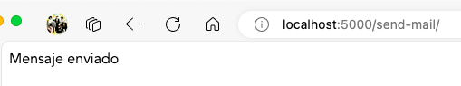
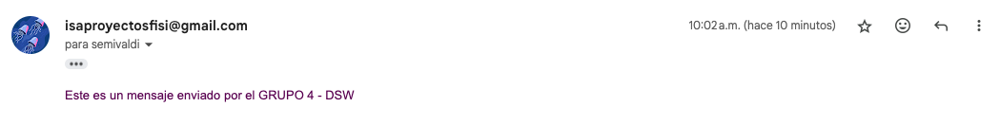

# Flask_email
Este proyecto es una demostración de cómo usar Flask-Mail en una aplicación Flask.

## Instalación
1. Clona el repositorio: `git clone https://github.com/caroSeminario23/Flask_email.git`
2. Entra en el directorio del proyecto: `cd flask_email`
3. Instala las dependencias: `pip install -r requirements.txt`

## Uso
Para ejecutar la aplicación, usa el comando: `python envio.py`

## Integrantes del grupo
- Carolina Seminario Valdivia
- David Fernandez Dávila
- Dylan Pereyra Exebio

## Capturas de ejecución
- Mensaje de envío exitoso del mensaje por correo electrónico

- Bandeja de envío desde el correo remitente

- Bandeja de recibidos desde el correo destinatario
